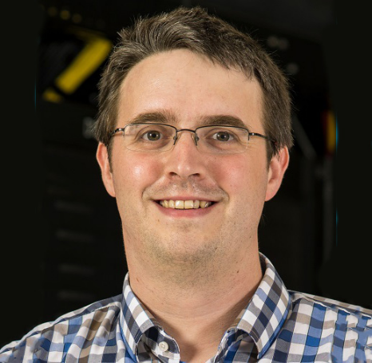
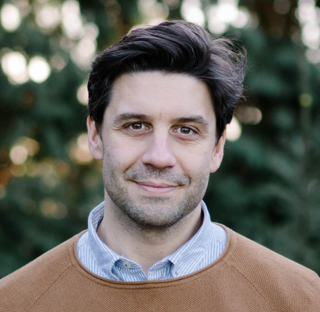

## Purpose and Benefits of HPC Systems

A High Performance Computing (HPC) cluster, is a collection of (large) computing resources, like Processors (CPUs), Graphics processors (GPUs), Memory and Storage, that are shared among a group of users.

Using multiple computers as such makes it possible to perform lengthy and resource-intense computations beyond the capabilities of a single computer, and is especially handy for modern scientific computing applications where datasets are typically large in size, models are big in parameters' size and complexity, and computations need specialized hardware (like GPUs and FPGAs). 

## Brief history of DAIC

The Delft AI Cluster (DAIC - formerly known as INSY-HPC or just plainly HPC) is an HPC cluster that was initiated within the INSY department in 2015. Later, resources were joined with ST, collectively called _CS@Delft_, and with other departments across faculties in subsequent expansion cycles. Today, DAIC servers are organized as partitions (see [Batch Queuing System Overview ](../job_submissions/#batch-queuing-system-overview)) that corresponds to the groups contributing these resources, as can be seen in Table 1.

 DAIC has been designed based on the needs of CS@Delft from the beginning. It has grown in time to serve researchers in other TU Delft Departments but maintained the needs of CS and AI in each expansion phase (See [TU Delft clusters comparison](../../tud_clusters/)).

<table>
<caption> Table 1: Current partitions within DAIC and contributing TU Delft departments/faculties.
</caption>
<thead>
  <tr>
    <th>I</th>
    <th>DAIC partition</th>
    <th>Contributor</th>
    <th>Faculty</th>
    <th>Faculty abbreviation (English/Dutch)</th>
  </tr>
</thead>
<tbody>
  <tr>
    <td>1</td>
    <td>3dgi</td>
    <td><a href="https://3d.bk.tudelft.nl/">3D Geoinformation Research Group</a></td>
    <td><a href="https://www.tudelft.nl/en/architecture-and-the-built-environment">Faculty of Architecture and the Built Environment</a></td>
    <td>ABE/BK</td>
  </tr>
  <tr>
    <td>2</td>
    <td>imphys</td>
    <td><a href="https://www.tudelft.nl/en/faculty-of-applied-sciences/about-faculty/departments/imphys">Imaging Physics</a></td>
    <td><a href="https://www.tudelft.nl/en/faculty-of-applied-sciences">Faculty of Applied Sciences</a></td>
    <td>AS/TNW</td>
  </tr>
  <tr>
    <td>3</td>
    <td>cor</td>
    <td><a href="https://www.tudelft.nl/3me/over/afdelingen/cognitive-robotics-cor">Cognitive Robotics</a></td>
    <td><a href="https://www.tudelft.nl/en/3me?%25252520L=0&cHash=a3739bc6939ece6b5c917f85a67226fa">Faculty of Mechanical, Maritime and Materials Engineering</a></td>
    <td>3mE</td>
  </tr>
  <tr>
    <td>4</td>
    <td>tbm</td>
    <td>Faculty of Technology, Policy and Management </td>
    <td><a href="https://www.tudelft.nl/en/tpm">Faculty of Technology, Policy and Management</a></td>
    <td>TPM/TBM</td>
  </tr>
  <tr>
    <td>5</td>
    <td>grs</td>
    <td><a href="https://www.tudelft.nl/citg/over-faculteit/afdelingen/geoscience-remote-sensing">Geoscience &amp; Remote Sensing</a></td>
    <td><a href="https://www.tudelft.nl/en/ceg">Faculty Of Civil Engineering and Geosciences</a></td>
    <td>CEG/CiTG</td>
  </tr>
  <tr>
    <td>6</td>
    <td>influence</td>
    <td rowspan="3"><a href="https://www.tudelft.nl/en/eemcs/the-faculty/departments/intelligent-systems">Intelligent Systems</a></td>
    <td rowspan="5"><a href="https://www.tudelft.nl/en/eemcs">Faculty of Electrical Engineering, Mathematics &amp; Computer Science</a></td>
    <td rowspan="5">EEMCS/EWI</td>
  </tr>
  <tr>
    <td>7</td>
    <td>visionlab</td>
  </tr>
  <tr>
    <td>8</td>
    <td>insy</td>
  </tr>
  <tr>
    <td>9</td>
    <td>wis</td>
    <td rowspan="2"><a href="https://www.tudelft.nl/ewi/over-de-faculteit/afdelingen/software-technology">Software Technology</a></td>
  </tr>
  <tr>
    <td>10</td>
    <td>st</td>
  </tr>
</tbody>
</table>

## DAIC advisory board


  
  
  
  
  
  
  
  
  

