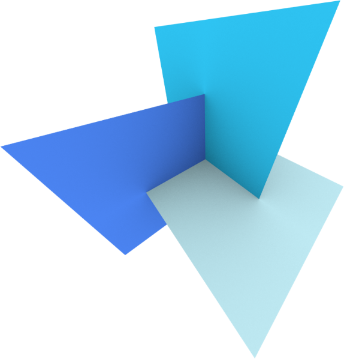

## Contributing departments
The Delft AI Cluster (DAIC - formerly known as INSY-HPC or just plainly HPC) is an HPC cluster that was initiated within the INSY department in 2015. Later, resources were joined with ST, collectively called _CS@Delft_, and with other departments across faculties in subsequent expansion cycles. Today, DAIC servers are organized as partitions (see [Batch Queuing System Overview ](/docs/introduction/system/scheduler#batch-queuing-system-overview)) that corresponds to the groups contributing these resources, as can be seen in Table 1.

 DAIC has been designed based on the needs of CS@Delft from the beginning. It has grown in time to serve researchers in other TU Delft Departments but maintained the needs of CS and AI in each expansion phase (See [TU Delft clusters comparison](tud-clusters)).

<table>
<caption> Table 1: Current partitions within DAIC and contributing TU Delft departments/faculties.
</caption>
<thead>
  <tr>
    <th>I</th>
    <th>DAIC partition</th>
    <th>Contributor</th>
    <th>Faculty</th>
    <th>Faculty abbreviation (English/Dutch)</th>
  </tr>
</thead>
<tbody>
  <tr>
    <td>1</td>
    <td>3dgi</td>
    <td><a href="https://3d.bk.tudelft.nl/">3D Geoinformation</a></td>
    <td><a href="https://www.tudelft.nl/en/architecture-and-the-built-environment">  Faculty of Architecture and the Built Environment</a></td>
    <td>ABE/BK</td>
  </tr>
  <tr>
    <td>2</td>
    <td>asm</td>
    <td> <a href="https://www.tudelft.nl/en/ae/organisation/departments/aerospace-structures-and-materials">  Aerospace Structures and Materials</a></td>
    <td><a href="https://www.tudelft.nl/en/ae">Faculty of Aerospace Engineering</a></td>
    <td>AE/LR</td>
  </tr>
  <tr>
    <td>3</td>
    <td>imphys</td>
    <td><a href="https://www.tudelft.nl/en/faculty-of-applied-sciences/about-faculty/departments/imphys">Imaging Physics</a></td>
    <td><a href="https://www.tudelft.nl/en/faculty-of-applied-sciences">Faculty of Applied Sciences</a></td>
    <td>AS/TNW</td>
  </tr>
  <tr>
    <td>4</td>
    <td>cor</td>
    <td><a href="https://www.tudelft.nl/me/over/afdelingen/cognitive-robotics-cor">Cognitive Robotics</a></td>
    <td><a href="Mechanical Engineering">Faculty of Mechanical Engineering</a></td>
    <td>ME</td>
  </tr>
  <tr>
    <td>5</td>
    <td>grs</td>
    <td><a href="https://www.tudelft.nl/citg/over-faculteit/afdelingen/geoscience-remote-sensing">Geoscience &amp; Remote Sensing</a></td>
    <td><a href="https://www.tudelft.nl/en/ceg">Faculty Of Civil Engineering and Geosciences</a></td>
    <td>CEG/CiTG</td>
  </tr>
  <tr>
    <td>6</td>
    <td>influence</td>
    <td rowspan="3"><a href="https://www.tudelft.nl/en/eemcs/the-faculty/departments/intelligent-systems">Intelligent Systems</a></td>
    <td rowspan="5"><a href="https://www.tudelft.nl/en/eemcs">Faculty of Electrical Engineering, Mathematics &amp; Computer Science</a></td>
    <td rowspan="5">EEMCS/EWI</td>
  </tr>
  <tr>
    
  </tr>
  <tr>
    <td>7</td>
    <td>insy</td>
  </tr>
  <tr>
    <td>8</td>
    <td>st</td>
    <td rowspan="2"><a href="https://www.tudelft.nl/ewi/over-de-faculteit/afdelingen/software-technology">Software Technology</a></td>
  </tr>

</tbody>
</table>