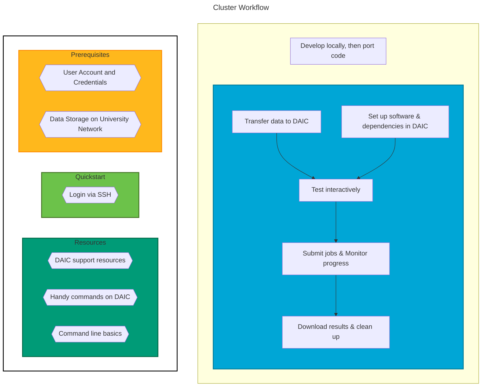

This guide provides the basic steps to get you started with the Delft AI Cluster (DAIC). You’ll learn how to log in and submit your first SLURM job.


If you join the DAIC community channel on [Mattermost](https://mattermost.tudelft.nl/daic/channels/town-square), you'll have access to exclusive resources and support.


## General Workflow

The interactive diagram below outlines the general workflow when working with the Delft AI Cluster (DAIC) cluster. Each step links to detailed documentation.





## Login via SSH

1. Open your terminal and run the following SSH command:

```shell-session
$ ssh <YouNetID>@login.daic.tudelft.nl
```

{}
If you are outside the TU Delft network you should first login to the TU Delft network with [eduVPN](https://tudelft.eduvpn.nl/portal/home). For more information about configuring SSH and the VPN, please visit [How to connect to DAIC?](/docs/manual/connecting).
{}

2. You will be prompted for your password:

```shell-session
The HPC cluster is restricted to authorized users only.

YourNetID@login.daic.tudelft.nl's password: 
Last login: Mon Jul 24 18:36:23 2023 from tud262823.ws.tudelft.net
 #########################################################################
 #                                                                       #
 # Welcome to login1, login server of the HPC cluster.                   #
 #                                                                       #
 # By using this cluster you agree to the terms and conditions.          #
 #                                                                       #
 # For information about using the HPC cluster, see:                     #
 # https://login.hpc.tudelft.nl/                                         #
 #                                                                       #
 # The bulk, group and project shares are available under /tudelft.net/, #
 # your windows home share is available under /winhome/$USER/.           #
 #                                                                       #
 #########################################################################
 18:40:16 up 51 days,  6:53,  9 users,  load average: 0,82, 0,36, 0,53
YourNetID@login1:~$ 
```

Congratulations, you just logged in to the Delft AI Cluster!

## Submit a job to SLURM

To submit a Python script using SLURM:

1. Create a Python script, eg, the file below named `script.py`:
   
   import time
   time.sleep(60)  # Simulate some work.
   print("Hello SLURM!")
   


2. Create a SLURM submission file `submit.sh` with the following content:

   
   #!/bin/sh
   #SBATCH --partition=general   # Request partition. Default is 'general'. Select the best partition following the advice on  https://daic.tudelft.nl/docs/manual/job-submission/priorities/#priority-tiers
   #SBATCH --qos=short           # Request Quality of Service. Default is 'short' (maximum run time: 4 hours)
   #SBATCH --time=0:05:00        # Request run time (wall-clock). Default is 1 minute
   #SBATCH --ntasks=1            # Request number of parallel tasks per job. Default is 1
   #SBATCH --cpus-per-task=2     # Request number of CPUs (threads) per task. Default is 1 (note: CPUs are always allocated to jobs per 2).
   #SBATCH --mem=1GB             # Request memory (MB) per node. Default is 1024MB (1GB). For multiple tasks, specify --mem-per-cpu instead
   #SBATCH --mail-type=END       # Set mail type to 'END' to receive a mail when the job finishes. 
   #SBATCH --output=slurm_%j.out # Set name of output log. %j is the Slurm jobId
   #SBATCH --error=slurm_%j.err  # Set name of error log. %j is the Slurm jobId
   
   # Some debugging logs
   which python 1>&2  # Write path to Python binary to standard error
   python --version   # Write Python version to standard error
   
   # Run your script with the `srun` command:
   srun python script.py
   


{}
It is important to run your script with the `srun` command. `srun` is a command in SLURM used to submit and manage parallel or batch jobs on a cluster. It allocates resources, executes tasks, monitors job progress, and returns job output to users.
{}


3. Submit the job to the queuing system with the `sbatch` command:
   ```shell-session
   $ sbatch submit.sh 
   Submitted batch job 9267828
   ```
4. Monitor the job’s progress with the `squeue` command:
    ```shell-session
    $ squeue -u $USER 
    JOBID PARTITION     NAME     USER ST       TIME  NODES NODELIST(REASON)
    9267834   general script.s <netid>   R       0:18      1 grs1
    ```

5. When your job finishes you will get a notification via email. Then you can see that two files have been created in your home directory, or in the directory where you submitted the job: `slurm_9267834.out` and `slurm_9267834.err` where the number corresponds to the job-id that SLURM had assigned to your job. You can see the content of the files with the `cat` command:
    ```shell-session
    $ cat slurm_9267834.err
    /usr/bin/python
    Python 2.7.5
    
    $ cat slurm_9267834.out
    Hello SLURM!
    ```

You can see that the standard output of your script has been written to the file `slurm_9267834.out` and the standard error was written to `slurm_9267834.err`. For more useful commands at your disposal have a look [here](/docs/manual/commands).

For more detailed job submission instructions, see [Job Submission](/docs/manual/job-submission/).

## Next Steps

It is strongly recommended that users read the [Containers Tutorial](/tutorials/apptainer/). Using containers simplifies the process of setting up reproducible environments for your workflows, especially when working with different dependencies and software versions.

## Additional resources

0. [DAIC training materials](/support/training)
2. [Unix Shell Basics (Software Carpentry)](https://swcarpentry.github.io/shell-novice/)
3. [DAIC Support Resources](/support)